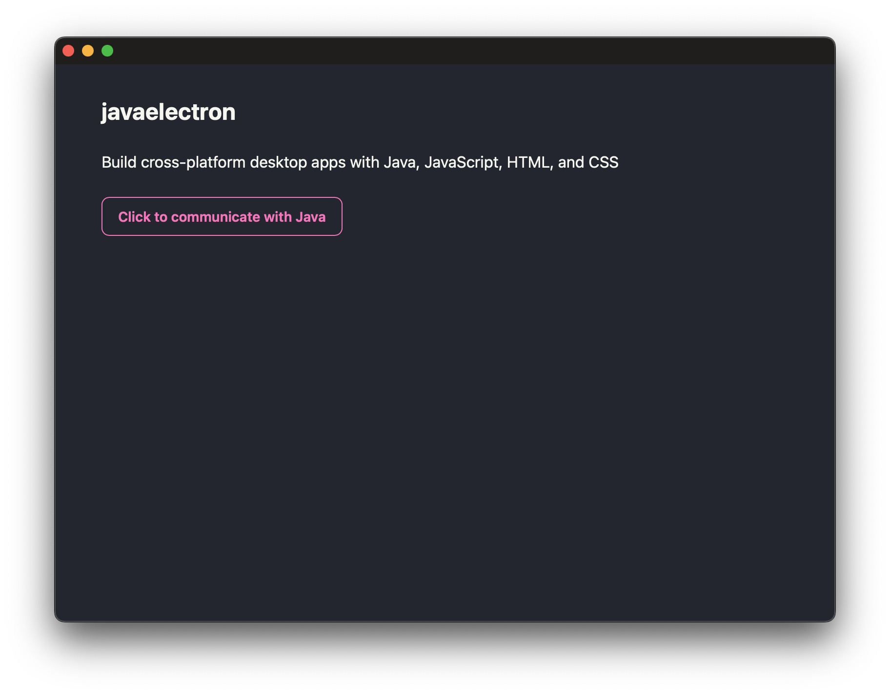

Java Electron
===============================================================================

It's like Electron but for Java. Now you can build cross-platform desktop apps with Java, JavaScript, HTML, and CSS.

The example app runs in MacOS's App Sandbox, can be notarized successfully, and is ~50MB in its final size. The example app currently works with Mac 
ARM. Other platforms are coming soon as I work toward launching the desktop version of [Backdoor](https://github.com/tanin47/backdoor) (Database Querying and Editing Tool for you and your team) on different platforms.

How to run
-----------

1. Run `npm run hmr` in one terminal and run `./gradlew run` in another terminal. This supports hot-reloading your JS code.
2. Run `./gradlew jpackage` to build the DMG installer. Then, you can extract the DMG at `./build/jpackage`.
3. Run `./gradlew staple` to build, notarize, and staple the DMG.

To dos
-------

- [ ] Push Minum changes upstream and remove Minum
